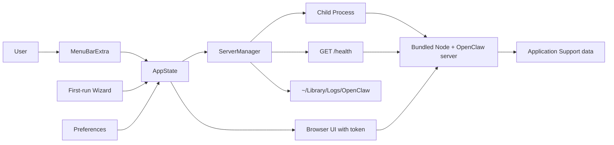

# Architecture

OpenClaw for macOS is split into a small native launcher and the bundled OpenClaw server runtime.

## Native launcher

The launcher is a SwiftUI app with `LSUIElement=true`, so it appears in the menu bar instead of the Dock. `OpenClawApp` owns the `MenuBarExtra`, and `AppState` is the single observable state source for server status, port, errors, first-run state, and uptime.

## Server runtime

`ServerManager` launches the server as a child process through `Foundation.Process`. It resolves the active runtime through `RuntimeBundle`, starts the executable, streams logs, parses `LISTENING_ON:<port>` if emitted by the server, and runs a `/health` poll every two seconds.

The bundled runtime lives in `OpenClaw/Resources/runtime` during development and becomes `OpenClaw.app/Contents/Resources/runtime` after build.

## Data paths

- Data: `~/Library/Application Support/OpenClaw`
- Cache: `~/Library/Caches/OpenClaw`
- Logs: `~/Library/Logs/OpenClaw`
- Preferences: `~/Library/Preferences/com.openclaw.app.plist`
- Auth token: `~/Library/Application Support/OpenClaw/auth_token`

## Updates

`UpdateManager` wraps Sparkle. Appcast metadata is generated by `Scripts/appcast.sh` and should be published to a stable HTTPS endpoint.

